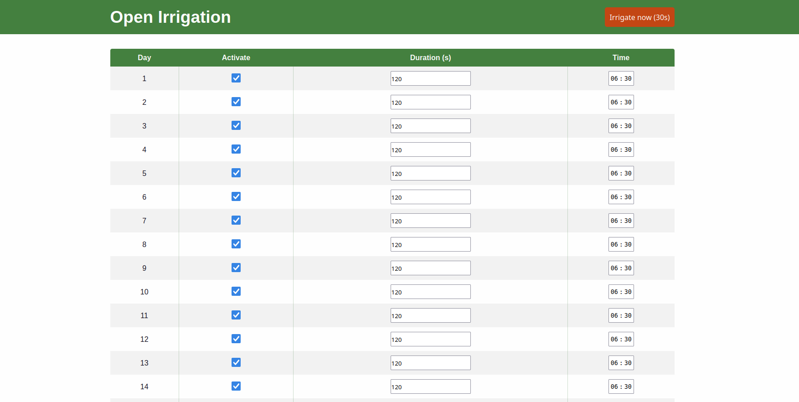

# Open Irrigation

A **stand‑alone Wi‑Fi irrigation scheduler** powered by an ESP8266.  The firmware spins up its own web‑server, so you can configure and trigger watering directly from any browser on the same network—no cloud, hub, or mobile app required.

### Desktop view


### Mobile view

---

## Quick Overview

| Day    | Default Status | Default Duration | Default Start Time |
| ------ | -------------- | ---------------- | ------------------ |
| 1 – 31 | **Enabled**    | **120 s**        | **06:30**          |

* **Per‑day control** – toggle individual days, set start time and duration in seconds.
* **Manual pulse** – orange *Irrigate now* button triggers a 30 s cycle instantly.
* **Persistent storage** – schedule is saved to on‑chip EEPROM.
* **Runs off the grid** – once flashed, the ESP8266 handles everything; no external server needed.

---

## Features

* **Responsive Web UI** served directly from the micro‑controller (no SD card).
* **Password‑protected Wi‑Fi** connection (station + AP fallback for first‑time setup).
* **RTC via NTP** – keeps accurate time as long as Wi‑Fi is available.
* **Fails‑safe** – watchdog‑guarded loop and a max‑duration cut‑off to protect the pump.
* **OTA Updates** – upload new firmware without cables (optional, can be disabled).

---

## Bill of Materials

| Qty | Item                                                     | Notes                      |
| --: | -------------------------------------------------------- | -------------------------- |
|   1 | ESP8266 dev‑board (e.g. **Wemos D1 mini** / **NodeMCU**) | 4 MB flash recommended     |
|   1 | 5 V single‑channel relay module                          | Drives valve/pump          |
|   1 | Solenoid valve **or** DC pump                            | Match to your water system |
|   1 | 5 V USB supply for ESP                                   | 500 mA or better           |
|   1 | 12 V (or required) supply for valve/pump                 | Keep grounds common        |
|   — | Jumper wires, enclosure, etc.                            | Weather‑proof if outdoors  |

---

## Getting Started

### 1. Clone the repo

```bash
git clone https://github.com/your‑handle/open‑irrigation.git
cd open‑irrigation
```

### 2. Install the tool‑chain

* **Arduino IDE** ≥ 2.3 or PlatformIO
* ESP8266 core ≥ 3.1.2
* Libraries: `ESP8266WiFi`, `ESP8266WebServer`, `time`, `EEPROM` (all come with the core)

### 3. Configure Wi‑Fi

Open `open_irrigation.ino` and fill in:

```cpp
const char* ssid     = "YOUR_SSID";
const char* password = "YOUR_WIFI_PASSWORD";
```

### 4. Flash the board

Select your ESP8266, port, flash @ 115200 baud, then upload.

### 5. Find the device

The first boot starts in **Access Point mode** (`OpenIrrigation‑xxxx`).

1. Connect with your phone/laptop.
2. Browse to `192.168.4.1` and enter your home Wi‑Fi details.
3. Reboot occurs & the ESP reconnects as a **station**.  Watch the Serial Monitor or your router’s DHCP list for the new IP.

---

## Using the Web Interface

1. Navigate to the device IP in any browser.
2. For each day (**1–31**):

   * **Activate** checkbox – enable/disable watering for that day.
   * **Duration (s)** – seconds the pump/valve stays on (default `120`).
   * **Time** – 24 h clock when watering starts (default `06:30`).
3. Press **Save Schedule**.
4. Hit **Irrigate now** for an immediate 30 s test.

> **Tip:** All settings persist after power loss.  The next reset restores the last saved schedule.

---

## GPIO Mapping (default)

| Function   | GPIO | Board Label            |
| ---------- | ---- | ---------------------- |
| Relay IN   | D1   | GPIO5                  |
| Status LED | D4   | GPIO2 (*on‑board LED*) |

You can change these pins at the top of the sketch.

---

## License

This project is released under the **MIT License** – see [`LICENSE`](LICENSE) for details.

---
